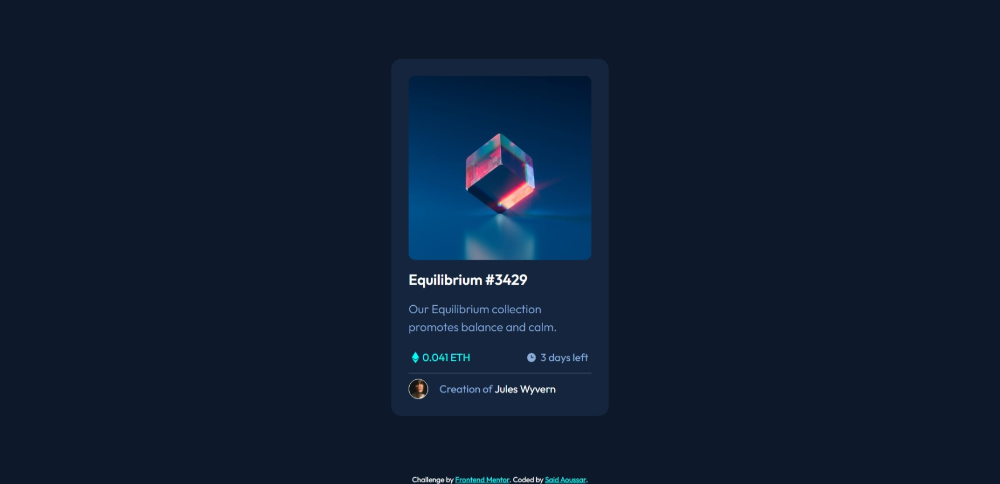

# Frontend Mentor - NFT preview card component solution

This is a solution to the [NFT preview card component challenge on Frontend Mentor](https://www.frontendmentor.io/challenges/nft-preview-card-component-SbdUL_w0U). Frontend Mentor challenges help you improve your coding skills by building realistic projects.

## Table of contents

- [The challenge](#the-challenge)
- [Screenshot](#screenshot)
- [Links](#links)
- [Built with](#built-with)
- [Author](#author)

### The challenge

Users should be able to:

- View the optimal layout depending on their device's screen size
- See hover states for interactive elements

### Screenshot

### Links

- Solution URL: [code](https://github.com/SaidAoussar/nft-preview-card-component)
- Live Site URL: [demo](https://saidaoussar.github.io/nft-preview-card-component/)

### Built with

- Semantic HTML5 markup
- Flexbox
- Mobile-first workflow
- [Sass](https://sass-lang.com/) - CSS with superpowers

## Author

- Website - [Said Aoussar](https://saidaoussar.tech/)
- Frontend Mentor - [@SaidAoussar](https://www.frontendmentor.io/profile/SaidAoussar)
- Twitter - [@SaidAoussar1](https://twitter.com/SaidAoussar1)
